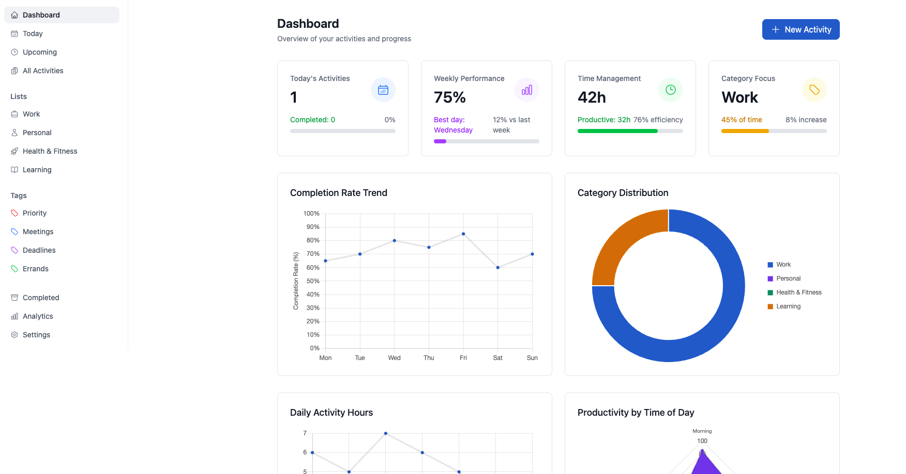

# TaskFlow - Modern Activity & Task Management

<p align="center">
  <h1 align="center">TaskFlow - Your Personal Activity Assistant</h1>
  <p align="center">
    A modern, intuitive Vue 3 application for managing your daily activities, habits, and tasks.
  </p>
</p>

## About

TaskFlow is a comprehensive activity management application built with Vue 3 and Vite. It helps you organize your daily life with:

1. **Activity Management:** Track and manage your daily activities with ease
2. **Habit Building:** Monitor and maintain your daily habits
3. **Task Management:** Organize tasks with categories and priorities
4. **Smart Reminders:** Never miss important events or deadlines

## Features

- **Modern UI/UX:** Clean and intuitive interface built with Tailwind CSS
- **Activity Dashboard:** View and manage all your activities in one place
- **Habit Tracking:** Build and maintain positive habits with visual tracking
- **Smart Categories:** Organize tasks and activities by work, personal, learning, health, and more
- **Progress Tracking:** Monitor your completion rates and activity patterns
- **Responsive Design:** Works seamlessly on desktop and mobile devices

## Screenshots

### Dashboard Overview



<p align="center"><i>The modern dashboard provides a visual overview of your activities, completion rates, category distribution, and productivity trends.</i></p>

## Built with

- [Vue 3](https://vuejs.org/) - The Progressive JavaScript Framework
- [Vite](https://vitejs.dev/) - Next Generation Frontend Tooling
- [Tailwind CSS](https://tailwindcss.com/) - A utility-first CSS framework
- [Pinia](https://pinia.vuejs.org/) - The Vue Store that you will enjoy using
- [Heroicons](https://heroicons.com/) - Beautiful hand-crafted SVG icons

## Getting Started

### Prerequisites

- Node.js >= 18.0.0
- pnpm >= 8.6.12

### Installation

1. Clone the repository

```bash
git clone https://github.com/yourusername/justdo-vue.git
cd justdo-vue
```

2. Install dependencies

```bash
pnpm install
```

3. Start the development server

```bash
pnpm dev
```

4. Build for production

```bash
pnpm build
```

## Project Structure

```
src/
├── core/               # Core components and utilities
├── modules/           # Feature modules
│   ├── activities/    # Activity management
│   ├── habits/        # Habit tracking
│   └── tasks/        # Task management
├── styles/           # Global styles and Tailwind config
└── views/            # Page components
```

## Contributing

1. Fork the Project
2. Create your Feature Branch (`git checkout -b feature/AmazingFeature`)
3. Commit your Changes (`git commit -m 'Add some AmazingFeature'`)
4. Push to the Branch (`git push origin feature/AmazingFeature`)
5. Open a Pull Request

## License
