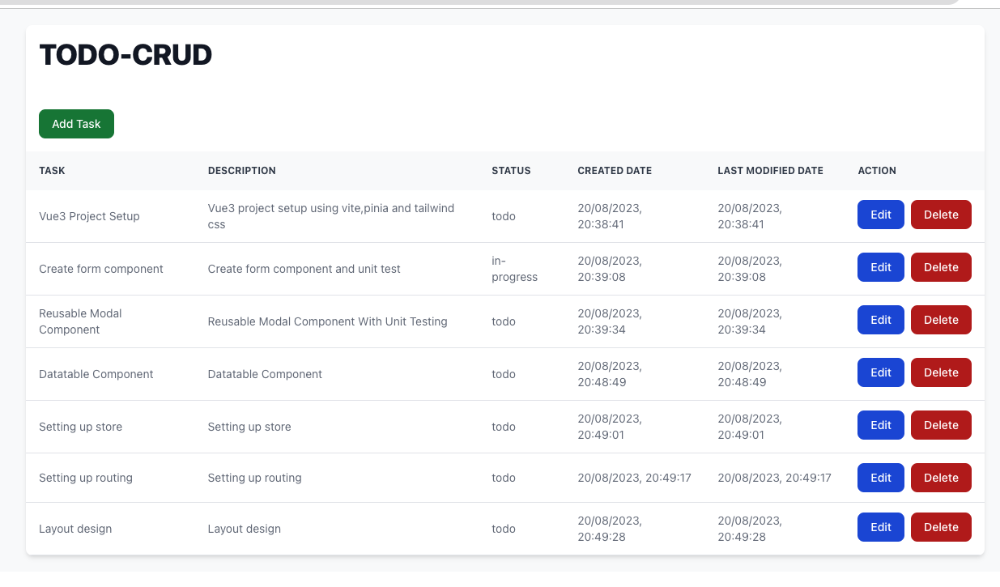

# Vue 3 Task Manager

A beginner-friendly task management application built with Vue 3 and Tailwind CSS. Perfect for learning modern web development practices.

## 🌟 What You'll Learn

- Building a complete web application with Vue 3
- Working with components and props
- Managing application state
- Handling user interactions
- Implementing CRUD operations
- Styling with Tailwind CSS
- Using TypeScript for better code quality

## 🚀 Live Demo

Try it out: [Live Demo](https://vue3-tailwind-todo.vercel.app/)

## 🛠️ Built With

- Vue 3 (JavaScript Framework)
- Tailwind CSS (Styling)
- TypeScript (Type Safety)
- Vue Router (Navigation)
- State Management
- Vite (Build Tool)

## 📋 Prerequisites

Before you begin, ensure you have installed:
- Node.js (version 16 or higher)
- npm (comes with Node.js)
- Git

## 🎯 Getting Started

1. Clone the project:

